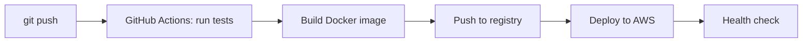

# Abundant Joel

The first thing you should know about me is that I actually love a good mess. Give me a chaotic, undefined environment, and I will build you a seamless system that runs like clockwork.

Most of my focus is on setting up the pipelines that test code and ship it to automatically and drawing how everything connects so the next person can follow it without asking me.

I'm finishing my IT degree in Minna, Nigeria, and I'm looking for a junior DevOps or cloud role (remote is fine). 

[LinkedIn](https://www.linkedin.com/in/abundant-joel-5a8a79277) · [Email](mailto:zeromerge.dev@gmail.com) · [YouTube](https://youtube.com/@zeromergedev) · [X](https://twitter.com/ZeroMerge)

## ⚙️ What I do

- Draw and Write pipelines that run tests, build a Container image and deploy it on every push.
- Run apps in Docker containers on AWS/Azure.
- Turn repeat manual jobs into Bash scripts.
- Administer Linux servers.

## How a change reaches production in my projects

## 🔭 Background

Before DevOps I worked in brand design and i have been a brand strategist and lead for some startups and organizations. It taught me to explain something complicated with one clear picture and focus on execution with sixth sense of what could go wrong and mitigate it, and that's most of what good infrastructure documentation is.

## Right now

- Building the AWS deployment for my TechCrush capstone project.
- Working through Pluralsight's IT and DevOps track.
